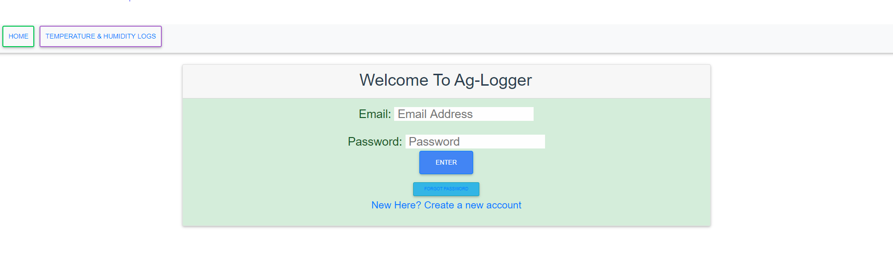
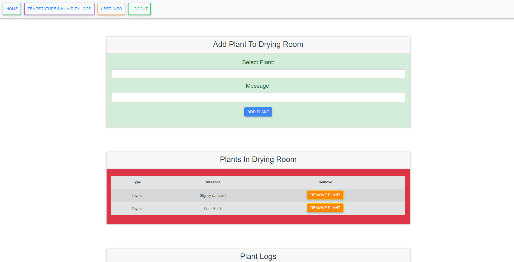
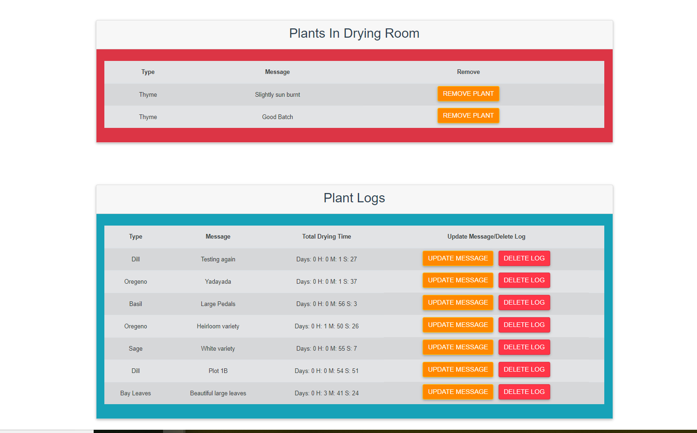
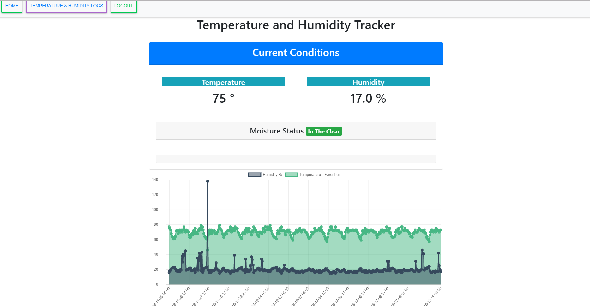
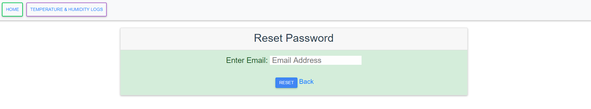
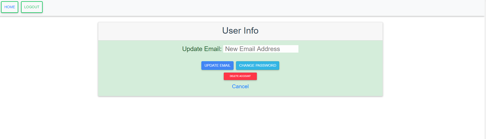

# Data Logger for Small Farm
Link To Graph Web Page Repo
https://github.com/sonofmath/vue_firebase/tree/master/mdbvuefire

## Login Page



## Home Page
```
On the Home page there is full CRUD-ability with the plants and the drying logs
```





## Temp and Humidity Data and Graph



## User CRUD Stuff




